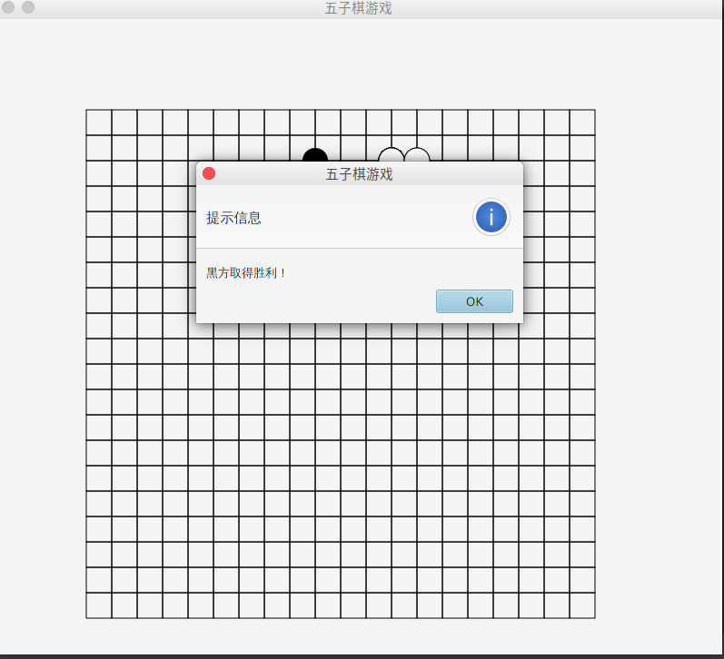
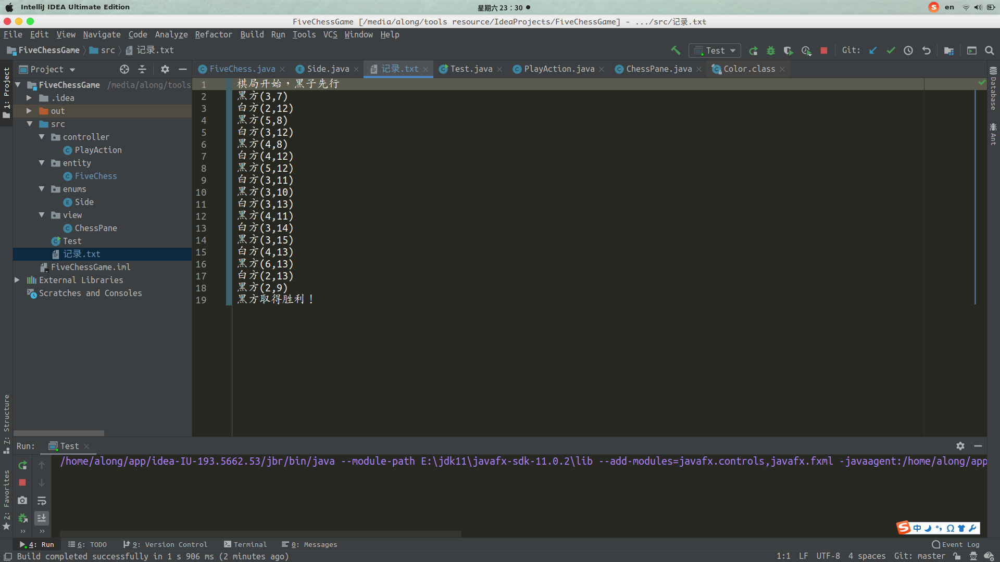

## 游戏描述

一个五子棋游戏，能实现双方黑白对决，当一方获胜时给出提示信息，利用Javafx实现GUI界面实现


### 上手须知

jdk11以上由于官方已经讲javafx组件分离，需要自己下载相应的组件，需要点击configuration然后在vm options中添加下面参数，注意将你的javafx插件路径替换成你自己的（jdk1.8的盆友请忽略）

```
--module-path "E:\jdk11\javafx-sdk-11.0.2\lib" --add-modules=javafx.controls,javafx.fxml
```


### 效果图





点击`src`目录下的`记录.txt`文件查看本次对局记录详情

